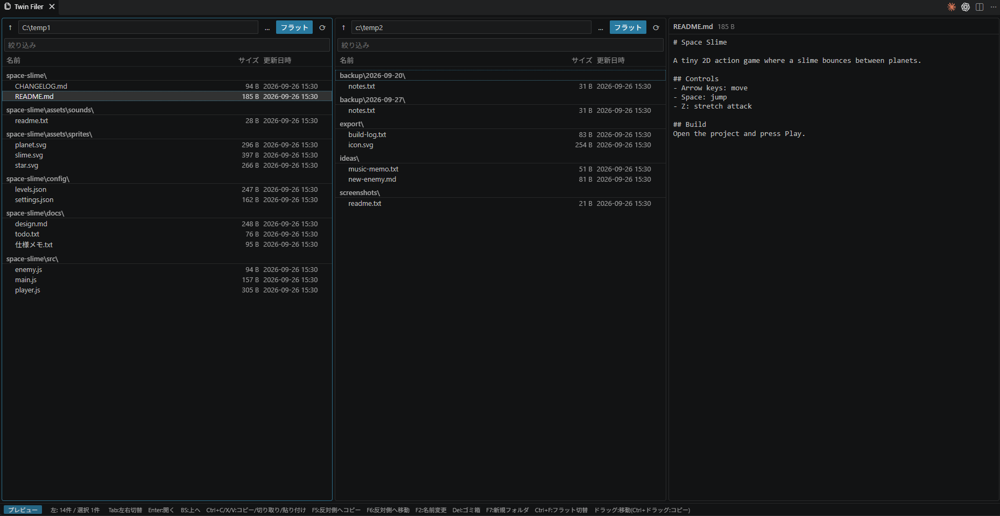

# Twin Filer

[English](#english) | [日本語](#日本語)



---

## English

A two-pane file manager that runs inside VS Code — plus a third pane that previews the selected file.
The idea is to open a separate VS Code window and use it as your file manager.

### Features

- **Two panes, side by side** — browse a different folder in each pane
- **Flat view** — list every file under the current folder's subfolders, grouped by folder
- **Preview pane** — text (UTF-8 / Shift_JIS), images, and folder contents
- **Drag & drop** — drag to move, Ctrl+drag to copy (drop onto a folder row to put it inside)
- **Copy / cut / paste** — Ctrl+C / Ctrl+X / Ctrl+V; pasting into the same folder creates "name - Copy"
- **Safe delete** — always goes to the Trash, with a confirmation
- **Overwrite confirmation** — Overwrite / Overwrite All / Skip
- **Right-click menu** and keyboard shortcuts
- Remembers each pane's folder between sessions
- English and Japanese UI (follows VS Code's display language)

### Keyboard shortcuts

| Key | Action |
|---|---|
| Tab / ← → | Switch pane |
| ↑ ↓ / PageUp / PageDown / Home / End | Move cursor (Shift to extend selection) |
| Space | Toggle selection |
| Enter | Open (Shift+Enter: open with the default app) |
| Backspace | Up one level |
| Ctrl+C / Ctrl+X / Ctrl+V | Copy / Cut / Paste |
| F5 / F6 | Copy / Move to the other pane |
| F2 | Rename |
| Delete | Move to Trash |
| F7 | New folder |
| Ctrl+F | Toggle flat view |
| Ctrl+R | Refresh |
| Ctrl+A | Select all |

These shortcuts only apply while the Twin Filer tab is active, and they are passed to text editing while you type in the path or filter box.

### Install (from source)

Twin Filer is not on the Marketplace yet.

```bash
git clone https://github.com/Toshiaki1973/twin-filer.git
cd twin-filer
npx @vscode/vsce package          # creates twin-filer-<version>.vsix
code --install-extension twin-filer-*.vsix
```

Then run **Twin Filer: Open** from the Command Palette (Ctrl+Shift+P).

To try it without installing:

```bash
code --new-window --extensionDevelopmentPath=/path/to/twin-filer
```

### Notes

- Flat view skips `.git`, `node_modules`, `__pycache__` and `.venv`, does not follow symlinks/junctions, and stops at 5,000 files.
- The clipboard is internal to Twin Filer; it is not shared with the OS file manager.
- No dependencies and no build step — plain JavaScript.

### License

[MIT](LICENSE)

---

## 日本語

VS Codeの中で動く2画面ファイラーです。選んだファイルの中身を見られる、3つ目のプレビュー画面も付いています。
VS Codeのウィンドウを別にもう1枚開いて、ファイラー専用として使う想定です。

### できること

- **左右2画面** — それぞれ別のフォルダを表示
- **フラット表示** — サブフォルダ以下のファイルを、フォルダごとにまとめて一覧表示
- **プレビュー画面** — テキスト(UTF-8 / Shift_JIS)、画像、フォルダの中身
- **ドラッグ&ドロップ** — ドラッグで移動、Ctrl+ドラッグでコピー(フォルダの行に落とすとその中へ)
- **コピー / 切り取り / 貼り付け** — Ctrl+C / Ctrl+X / Ctrl+V。同じフォルダに貼ると「〇〇 - コピー」になります
- **安全な削除** — 確認のうえ、必ずゴミ箱へ
- **上書き確認** — 上書き / すべて上書き / スキップ
- **右クリックメニュー**とキーボード操作
- 左右のフォルダを次回起動時も覚えています
- 英語・日本語対応(VS Codeの表示言語に合わせて切り替わります)

### キー操作

| キー | 操作 |
|---|---|
| Tab / ← → | 左右の切り替え |
| ↑ ↓ / PageUp / PageDown / Home / End | カーソル移動(Shiftで範囲選択) |
| Space | 選択の切り替え |
| Enter | 開く(Shift+Enter: 既定のアプリで開く) |
| Backspace | 上のフォルダへ |
| Ctrl+C / Ctrl+X / Ctrl+V | コピー / 切り取り / 貼り付け |
| F5 / F6 | 反対側へコピー / 移動 |
| F2 | 名前の変更 |
| Delete | ゴミ箱へ |
| F7 | 新しいフォルダ |
| Ctrl+F | フラット表示の切り替え |
| Ctrl+R | 再読み込み |
| Ctrl+A | すべて選択 |

これらのキーはTwin Filerのタブを開いている間だけ有効です。パス欄や絞り込み欄で入力している間は、普通の文字入力として動きます。

### インストール(ソースから)

Marketplaceにはまだ公開していません。

```bash
git clone https://github.com/Toshiaki1973/twin-filer.git
cd twin-filer
npx @vscode/vsce package          # twin-filer-<version>.vsix ができます
code --install-extension twin-filer-*.vsix
```

インストール後、コマンドパレット(Ctrl+Shift+P)から **Twin Filer: 開く** を実行してください。

インストールせずに試すなら:

```bash
code --new-window --extensionDevelopmentPath=/path/to/twin-filer
```

### 補足

- フラット表示では `.git`・`node_modules`・`__pycache__`・`.venv` を除外し、シンボリックリンク/ジャンクションは辿りません。最大5,000件までです。
- クリップボードはTwin Filerの中だけのもので、エクスプローラー等とは共有しません。
- 依存パッケージなし・ビルド不要の素のJavaScriptです。

### ライセンス

[MIT](LICENSE)
